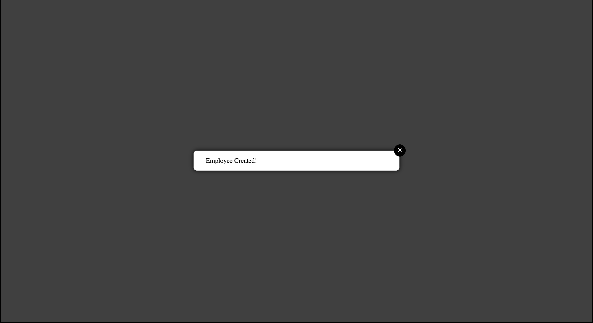

# Modal for ReactJS
This project is created by Clara Bernadou.

## Table of Contents
* [Installation](#installation)
* [API Documentation](#api-documentation)
* [Examples](#examples)
* [Rendering](#rendering)

## Installation
To install the Modal for ReactJS, follow these steps:

1. Install the package using npm:

   ```bash
   $ npm install reactjs-modal-clarabernadou
   ```

2. Install additional dependencies:

   ```bash
   $ npm install react react-dom react-scripts @fortawesome/fontawesome-svg-core @fortawesome/free-solid-svg-icons @fortawesome/react-fontawesome
   ```

## API Documentation
The Modal component provides the following API:

- `closeConfirmModal`: A function to close the modal. Pass this function as a prop to the Modal component.

## Examples
Here is an example of how to use the Modal component in your React application:

```jsx
import React, { useState, useEffect } from 'react';
import Modal from 'reactjs-modal-clarabernadou';

Modal.setAppElement('#yourAppElement');

function App() {
  const [showModal, setShowModal] = useState(false);
  const [isModalOpen, setIsModalOpen] = useState(false);

  useEffect(() => {
    if (isModalOpen) {
      document.body.style.overflow = 'hidden';
      document.querySelectorAll('input, select, textarea').forEach((el) => {
        el.setAttribute('disabled', 'disabled');
      });

      document.addEventListener('keydown', handleKeyDown);
      return () => {
        document.removeEventListener('keydown', handleKeyDown);
      };
    } else {
      document.body.style.overflow = 'auto';
      document.querySelectorAll('input, select, textarea').forEach((el) => {
        el.removeAttribute('disabled');
      });
    }
  }, [isModalOpen]);

  const openConfirmModal = () => {
    setShowModal(true);
    setIsModalOpen(true);
  };

  const closeConfirmModal = () => {
    setShowModal(false);
    setIsModalOpen(false);
  };

  const handleKeyDown = (event) => {
    if (event.key === 'Escape') {
      closeConfirmModal();
    }
  };

  return (
    <div className="test-modal">
      <button onClick={openConfirmModal}>Test open modal</button>
      {showModal && <Modal closeConfirmModal={closeConfirmModal} />}
    </div>
  );
}

ReactDOM.render(<App />, appElement);
```

Make sure to replace `#yourAppElement` with the appropriate selector for the root element of your React app.

## Rendering
Here is a screenshot of how the modal will look when rendered:



Please note that the styling of the modal can be customized to fit your application's design.