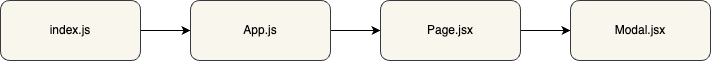

# Testing

## Modal Implementation
Here is an example of the modal implementation schema in the file structure of your React application:



## Installation
Start by installing the modal using the following command:
```
$ npm i reactjs-modal-clarabernadou
```

Next, install the necessary dependencies by running the following command:
```
$ npm i --save react react-dom react-scripts @fortawesome/fontawesome-svg-core @fortawesome/free-solid-svg-icons @fortawesome/react-fontawesome
```

Finally, start your application using the following command:
```
$ npm start
```

You can now begin implementing the modal in your file!

## Usage
Here's an example of how to use the modal in your code:

```jsx
import React, { useState, useEffect } from 'react';
import Modal from 'reactjs-modal-clarabernadou';

const YourComponent = () => {
    const [showModal, setShowModal] = useState(false);
    const [isModalOpen, setIsModalOpen] = useState(false);

    useEffect(() => {
        if (isModalOpen) {
            // Disable scrolling on the main page when the modal is open
            document.body.style.overflow = 'hidden';

            // Disable form elements on the main page to prevent interaction during the modal
            document.querySelectorAll('input, select, textarea').forEach((el) => {
                el.setAttribute('disabled', 'disabled');
            });

            // Add an event listener for the "Escape" key when the modal is open
            document.addEventListener('keydown', handleKeyDown);

            // Remove the event listener when the modal is closed or when the component is unmounted
            return () => {
                document.removeEventListener('keydown', handleKeyDown);
            };
        } else {
            // Restore scrolling on the main page when the modal is closed
            document.body.style.overflow = 'auto';

            // Re-enable form elements on the main page
            document.querySelectorAll('input, select, textarea').forEach((el) => {
                el.removeAttribute('disabled');
            });
        }
    }, [isModalOpen]);

    const openConfirmModal = () => {
        // Show the modal by updating the showModal and isModalOpen state
        setShowModal(true);
        setIsModalOpen(true);
    };

    const closeConfirmModal = () => {
        // Close the modal by updating the showModal and isModalOpen state
        setShowModal(false);
        setIsModalOpen(false);
    };

    const handleKeyDown = (event) => {
        if (event.key === 'Escape') {
            // Close the modal when the user presses the "Escape" key
            closeConfirmModal();
        }
    };

    return (
        <div className='test-modal'>
            {/* Button to open the modal */}
            <button onClick={openConfirmModal}>Test open modal</button>

            {/* Display the modal only if the showModal state is true */}
            {showModal && <Modal closeConfirmModal={closeConfirmModal} />}
        </div>
    );
};
```

Make sure to adapt this code according to your specific implementation.

## Licenses
Created by Clara Bernadou as part of the "JavaScript/React Application Developer" training program at OpenClassrooms.